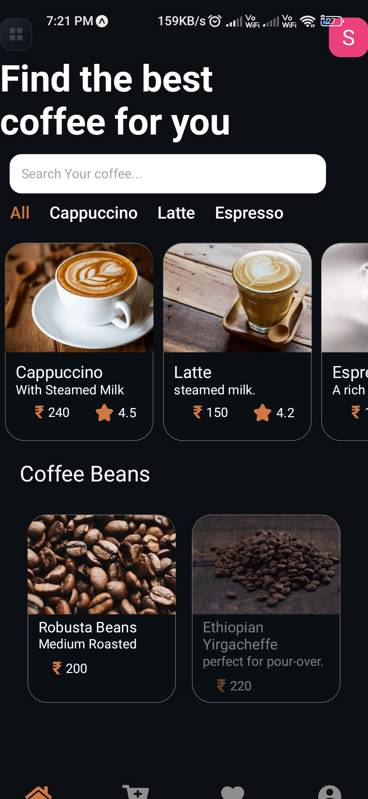

# Coffee Shop App ☕️📱

Welcome to the Coffee Shop App, a React Native application designed to enhance your coffee shopping experience with seamless browsing, secure authentication, and efficient database management.

<p align="center">

</p>

## Features

### ✅ Authentication
Users can securely log in and manage their accounts with ease, ensuring a personalized and secure experience.

### 🛒 Add to Cart
Customers can seamlessly browse and add their favorite coffee blends to the cart for a smooth and enjoyable shopping experience.

### ❤ Favorites
Save your favorite items for quick access on future visits, making it easier to reorder your beloved coffee blends.

### 🔒 Separate Login Data
Each user has unique login credentials, ensuring personalized experiences and maintaining security.

### 🌐 Dynamic Routing
The app’s navigation is dynamic, allowing users to easily explore different sections without any hassle.

### 📊 Firebase Database
The entire application is backed by Firebase, enabling real-time data syncing, secure storage, and efficient database management.

## Tech Stack

- **React Native:** For building the mobile app.
- **Firebase:** For real-time database, authentication, and storage.
- **Expo:** To streamline the development process and provide a smooth development environment.

## Installation

1. **Clone the repository:**
   ```bash
   git clone https://github.com/shrikantg199/Coffee_shop.git
   ```
2. **Navigate to the project directory:**
   ```bash
   cd coffeeshop-app
   ```
3. **Install dependencies:**
   ```bash
   npm install
   ```
4. **Start the application:**
   ```bash
   expo start
   ```

## Usage

- **Login:** Create an account or log in with your existing credentials.
- **Browse:** Explore different coffee blends and add your favorites to the cart.
- **Order:** Complete your purchase and enjoy your coffee!


